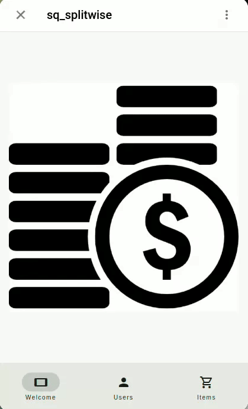
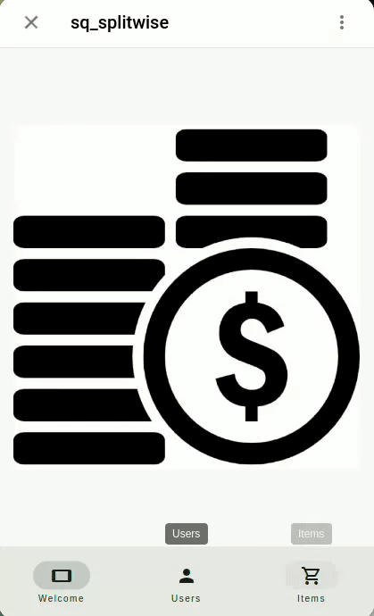
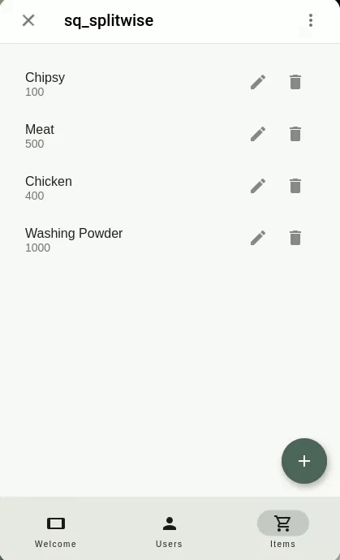

# SplitWise App Mini Application

## Description

[@sq_splitwise_bot](https://t.me/sq_splitwise_bot/sq_split) – a Mini App that manage shared expenses with ease. This SplitWise application in Dart provides a simple interface to list items, prices, and track shared expenses among users.

## Video Demonstration

### 1- Adding Users



### 2- Specifiy users who paid the check


### 3- Adding Items



### 4- Check the results



## Setup

### Telegram Bot Setup

1. Create a new bot using [BotFather](https://t.me/botfather)
2. Type `/newbot` and follow the instructions
3. Create new app using `/newapp` and follow instructions

### Ngrok Setup

Telegram mini app requires a public url (https) to work. We will use `ngrok` to expose our local server to the internet.

1. Download & install ngrok from [here](https://ngrok.com/download)
2. Run the following in your terminal

   ```
   ngrok http --domain=COPY_DOMAIN_IN_YOUR_NGROK_PROFILE 8080
   ```

   Remember that you can get your domain from dashboard [here](https://dashboard.ngrok.com/cloud-edge/domains)

3. Run the following in another terminal or in your VSC

```
flutter run -d web-server --web-renderer html --web-port 8080 --web-hostname 0.0.0.0
```

4. Now open [BotFather](https://t.me/botfather) in your browser then open your MiniApp
