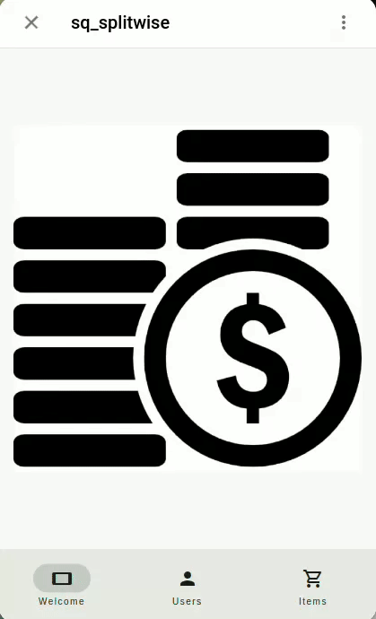
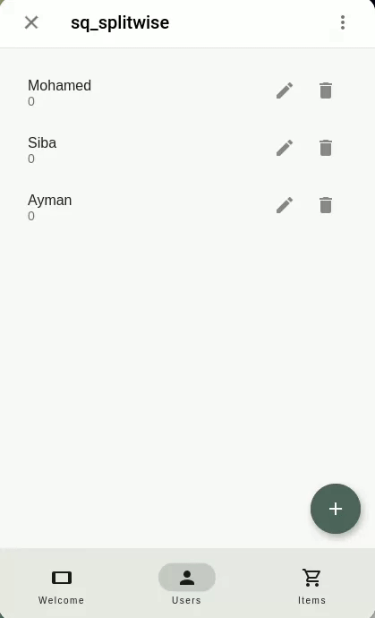
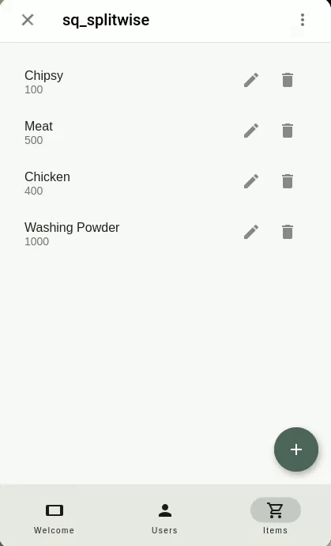

# SplitWise App Mini Application

## Description

[@sq_splitwise_bot](https://t.me/sq_splitwise_bot/sq_split) – a Mini App that manage shared expenses with ease. This SplitWise application in Dart provides a simple interface to list items, prices, and track shared expenses among users. It utilizes the Soar Quest package, and Flutter's Material UI for a user-friendly experience.

## Video Demonstration

### 1- Adding Users



### 2- Specifiy users who paid the check



### 3- Adding Items


### 4- Check the results



## Setup

### Telegram Bot Setup

1. Create a new bot using [BotFather](https://t.me/botfather)
2. Type `/newbot` and follow the instructions
3. Create new app using `/newapp` and follow instructions

### Ngrok Setup

Telegram mini app requires a public url (https) to work. We will use `ngrok` to expose our local server to the internet.

1. Download & install ngrok from [here](https://ngrok.com/download)
2. Run the following in your terminal

   ```
   ngrok http --domain=COPY_DOMAIN_IN_YOUR_NGROK_PROFILE 8080
   ```

   Remember that you can get your domain from dashboard [here](https://dashboard.ngrok.com/cloud-edge/domains)

3. Run the following in another terminal or in your VSC

```
flutter run -d web-server --web-renderer html --web-port 8080 --web-hostname 0.0.0.0
```

4. Now open [BotFather](https://t.me/botfather) in your browser then open your MiniApp

## Api Interaction

| Collections | Fields                | Description                                                                                                                 |
| ----------- | --------------------- | --------------------------------------------------------------------------------------------------------------------------- |
| Users       | - Username (String)   | Represents the username of a user.                                                                                          |
|             | - Cost Share (Double) | Represents the share of the cost for the user, default is 0.0.                                                              |
|             | - Did Pay (Bool)      | Represents whether the user paid or not, default is false.                                                                  |
|             | - Total Paid (Double) | Represents the total amount the user paid. Only shown if 'Did Pay' is true.                                                 |
|             | - Items (List)        | Represents the list of items the user is associated with. Derived from the Items collection using `SQInverseListRefsField`. |
| Items       | - Item Name (String)  | Represents the name of the item.                                                                                            |
|             | - Price (Double)      | Represents the price of the item.                                                                                           |
|             | - Users (List)        | Represents the list of users associated with an item.                                                                       |

### Functions & Callbacks

- **onDocSaveCallback (for Items)**
  - Triggered when the items save button is pressed.
  - Computes the cost share for each user based on items they're associated with.
  - Updates the 'Cost Share' field in the Users collection.

### Linking and Initialization

- **SQInverseListRefsField**

  - Links the Users collection to the Items collection. It enables an inverse reference from Users to Items using the field 'Items'.

- **SQApp Initialization**
  - The application initializes with a title `SQWise`.
  - Loads the collections for Users and Items.
  - Sets up the UI theme with a color scheme based on `Colors.tealAccent`.

### Screens & Pages

- **WelcomePage**

  - Displays a welcome image.

- **CollectionScreen (for Users)**

  - Represents the Users collection.
  - Icon: Person.

- **CollectionScreen (for Items)**
  - Represents the Items collection.
  - Icon: Shopping Cart.
